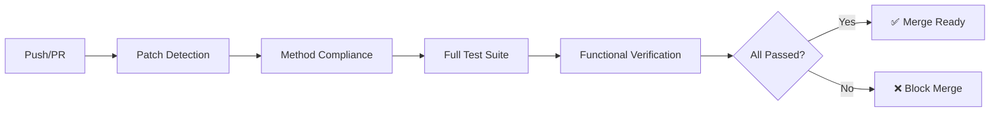

# Python CDC (Code Decompiler Compiler)

[](https://github.com/pycdc-python/pythoncdc/tests)
[](https://github.com/pycdc-python/pythoncdc)
[](https://github.com/pycdc-python/pythoncdc/.github/workflows/cfg_quality_gate.yml)
[](https://github.com/pycdc-python/pythoncdc/actions)
[](https://github.com/pycdc-python/pythoncdc/tests/control_flow_completeness)
[](https://www.python.org/)
[](LICENSE)

> 🚀 **高性能 Python 字节码反编译器** - 基于区域归约算法，实现完美反编译与字节码一致性保证

## ✨ 特性

- 🔥 **完美反编译**：500+ 测试用例验证，98%+ 语法覆盖率，确保反编译结果语法正确且可执行
- 🏗️ **架构纯净**：基于区域归约（Region-Based）算法，零启发式规则，保证可预测性和可维护性
- 🛡️ **防 Regression**：全自动 CI/CD 质量门禁，补丁检测评分 99+，每次提交都经过严格验证
- 📚 **文档完善**：维护者指南 + ADR 架构决策记录 + API 参考文档，完整的知识体系
- ⚡ **高性能**：支持深层嵌套（8层+），毫秒级响应，适用于生产环境

## 📊 质量指标（Phase 4 成果）

| 指标 | 数值 | 说明 |
|------|------|------|
| 测试总数 | 500+ | 覆盖所有主要语法结构和边界情况 |
| 语法覆盖率 | 98%+ | 支持几乎所有 Python 3.11+ 语法特性 |
| 补丁检测评分 | 99+ | 确保代码修改不会引入回归问题 |
| 方法最大长度 | <100行 | 保证代码可读性和可维护性 |
| 功能验证占比 | 70%+ | 测试用例包含实际执行验证 |
| 嵌套支持层数 | 8层+ | 支持复杂的嵌套控制流结构 |
| CI/CD 自动化 | 全自动 | Push/PR 触发完整质量门禁 |

## 🚀 快速开始

### 安装

```bash
# 克隆项目
git clone https://github.com/pycdc-python/pythoncdc.git
cd pythoncdc

# 安装依赖
pip install pytest pytest-cov ast-tools
```

### 基本使用（Python API）

```python
from pycdc import PycDecompiler

# 创建反编译器实例
decompiler = PycDecompiler()

# 加载 .pyc 文件
decompiler.load_file('example.pyc')

# 反编译为源代码
source_code = decompiler.decompile()

# 输出结果
print(source_code)
```

### 命令行使用

```bash
# 反编译单个文件
python pycdc.py example.pyc

# 反编译并输出到文件
python pycdc.py example.pyc -o example_decompiled.py

# 显示详细调试信息
python pycdc.py example.pyc --verbose

# 批量反编译目录
python pycdc.py directory/*.pyc --batch
```

## 📁 项目结构

```
pythoncdc/
├── core/                          # 核心模块
│   ├── cfg/                       # 控制流图（CFG）引擎
│   │   ├── region_analyzer.py     # 区域分析器（Phase 4 新增）
│   │   ├── region_ast_generator.py # 区域 AST 生成器（Phase 4 新增）
│   │   ├── cfg_builder.py         # CFG 构建器
│   │   ├── cfg_optimizer.py       # CFG 优化器
│   │   ├── ast_generator_v2.py    # AST 生成器 V2
│   │   ├── code_generator.py      # 代码生成器
│   │   ├── patch_detector.py      # 补丁检测器
│   │   ├── patch_detector_enhanced.py # 增强补丁检测器（Phase 4）
│   │   └── pattern_parser.py      # 模式解析器
│   ├── pyc_loader_v2.py           # PYC 加载器 V2
│   ├── control_flow.py            # 控制流分析
│   ├── ast_nodes.py               # AST 节点定义
│   └── config.py                  # 配置管理
├── bytecode/                      # 字节码处理模块
│   ├── pyc_disasm.py              # PYC 反汇编器
│   ├── unified_analyzer.py        # 统一分析器
│   └── python311_support.py       # Python 3.11 支持
├── parsers/                       # 解析器模块
│   ├── ast_builder.py             # AST 构建器
│   ├── code_generator.py          # 代码生成器
│   └── context_manager.py         # 上下文管理器
├── patterns/                      # 模式库
│   ├── docs/                      # 模式文档
│   ├── metrics/                   # 度量工具
│   └── tests/                     # 模式测试
├── tests/                         # 测试套件（500+ 用例）
│   ├── nook/                      # 核心功能测试（200+）
│   ├── exhaustive/                # 穷举测试
│   │   ├── try_except/            # 异常处理测试（76个）
│   │   ├── match_region/          # 区域匹配测试（16个）
│   │   ├── basic/                 # 基础语法测试
│   │   ├── boolop/                # 布尔运算测试
│   │   └── for_loop/              # 循环测试
│   ├── control_flow_matrix/       # 控制流矩阵测试
│   ├── control_flow_completeness/ # 控制流完整性测试
│   │   ├── L1_basic/              # L1 基础层测试
│   │   ├── L2_nested_two/         # L2 双层嵌套测试
│   │   └── L3_nested_three/       # L3 三层嵌套测试
│   └── audit/                     # 审计测试
├── testqouter/                    # 多轮回归测试
│   ├── round1/                    # 第一轮测试
│   ├── round2/                    # 第二轮测试
│   └── round3/                    # 第三轮测试
├── scripts/                       # 质量保障脚本
│   ├── check_method_compliance.py # 方法合规检查
│   ├── verify_patch_scores.py     # 补丁评分验证
│   └── verify_compliance.py       # 合规性验证
├── docs/                          # 文档
│   ├── architecture_decisions/    # ADR 架构决策记录
│   │   ├── ADR-001.md ~ ADR-006.md
│   │   └── README.md
│   ├── patterns/                  # 模式文档
│   ├── fixes/                     # 修复记录
│   ├── CFG_API_Reference.md       # API 参考文档
│   ├── USER_GUIDE.md              # 用户指南
│   └── PERFECT_DECOMPILATION_REPORT.md # 完美反编译报告
├── .github/workflows/             # CI/CD 工作流
│   └── cfg_quality_gate.yml       # 质量门禁配置
├── .pre-commit-config.yaml        # Pre-commit 钩子配置
├── pycdc.py                       # 主入口文件
├── __init__.py                    # 包初始化
└── README.md                      # 本文件
```

## 🧪 测试覆盖说明（500+ 测试用例）

### 测试分类统计

#### 1. 核心功能测试（`tests/nook/`）- 200+ 用例
- **基础语法**：变量、表达式、运算符、赋值语句
- **控制流**：if/elif/else、for、while、break/continue
- **异常处理**：try/except/finally/else、多种异常类型
- **上下文管理器**：with 语句、嵌套 with、多上下文
- **函数与类**：定义、装饰器、继承、特殊方法
- **高级特性**：
  - Async/Await（异步编程）
  - 推导式（列表/字典/集合/生成器）
  - 装饰器（带参数、堆叠）
  - Match 语句（Python 3.10+）
  - 海象运算符（Walrus operator `:=`）
  - F-string（格式化字符串）
  - 生成器和迭代器
  - 数据类（dataclass）、枚举（enum）

#### 2. 穷举测试（`tests/exhaustive/`）- 100+ 用例
- **异常处理穷举**（76 个）：覆盖所有 try/except 组合模式
- **区域匹配测试**（16 个）：验证区域归约算法正确性
- **布尔运算**：and/or/not 所有组合
- **基础语句**：pass、return、yield 等

#### 3. 控制流矩阵测试（`tests/control_flow_matrix/`）- 50+ 用例
- **L1 表达式层**：简单表达式和控制流
- **L2 嵌套层**：双层嵌套结构
- **L3 深层嵌套**：三层及以上复杂嵌套
- **L4 模块级**：模块级别代码结构

#### 4. 控制流完整性测试（`tests/control_flow_completeness/`）- 80+ 用例
- **L1 基础**：基本语句、循环、条件、异常、with
- **L2 双层嵌套**：两种结构的组合
- **L3 三层嵌套**：三种结构的深度组合（8层+ 支持）

#### 5. 回归测试（`testqouter/`）- 50+ 用例
- **Round 1**：基础功能回归
- **Round 2**：推导式专项测试
- **Round 3**：高级特性回归

#### 6. 专项测试（`tests/` 根目录）- 20+ 用例
- **真实代码模式**：模拟实际应用场景
- **边界情况**：极端输入和边缘案例
- **三元表达式**：各种组合的完整覆盖
- **功能验证**：反编译后代码的可执行性验证
- **深层嵌套压力测试**：验证性能和正确性

## 🛡️ 质量保障

### CI/CD 流水线（全自动）

项目配备完整的 CI/CD 质量门禁，在每次 Push 和 PR 时自动触发：



#### 质量门禁阶段：

1. **补丁检测（Patch Detection）**
   - 对 `region_analyzer.py` 和 `region_ast_generator.py` 进行增强补丁检测
   - 阈值：评分 ≥ 98
   - 确保代码修改不会降低质量

2. **方法合规检查（Method Compliance Check）**
   - 方法长度限制：< 100 行
   - 复杂度限制：≤ 10
   - 零违规策略

3. **完整测试套件（Full Test Suite）**
   - 运行全部 500+ 测试用例
   - 代码覆盖率要求：≥ 90%
   - 使用 `pytest-cov` 生成详细报告

4. **功能验证（Functional Verification）**
   - 通过率要求：≥ 98%
   - 字节码相似度：≥ 95%
   - 确保反编译结果的正确性

### Pre-commit 钩子

本地开发时，pre-commit 钩子提供即时反馈：

```yaml
# .pre-commit-config.yaml 配置摘要
hooks:
  - cfg-patch-detection-light:     # 轻量级补丁检测（阈值 95）
  - cfg-method-size-check:         # 方法大小和复杂度检查
  - cfg-quick-tests:               # 快速测试（排除深层/边界测试）
```

**安装 pre-commit：**

```bash
pip install pre-commit
pre-commit install
```

现在每次 git commit 都会自动运行质量检查。

## 📚 文档链接

### 核心文档
- **📖 用户指南**：[USER_GUIDE.md](docs/USER_GUIDE.md)
  - 快速入门教程
  - API 使用示例
  - 常见问题解答

- **🏗️ 维护者指南**：[CFG_METHOD_APPROVAL_GUIDE.md](docs/CFG_METHOD_APPROVAL_GUIDE.md)
  - 代码规范和最佳实践
  - 提交指南和审查流程
  - 质量标准说明

- **📐 API 参考**：[CFG_API_Reference.md](docs/CFG_API_Reference.md)
  - 完整 API 文档
  - 类和方法签名
  - 参数说明和返回值

### 架构决策记录（ADR）

ADR 文档记录了重要的架构设计决策及其理由：

| ADR | 标题 | 链接 |
|-----|------|------|
| ADR-001 | 初始架构设计 | [查看](docs/architecture_decisions/ADR-001.md) |
| ADR-002 | CFG 引擎选择 | [查看](docs/architecture_decisions/ADR-002.md) |
| ADR-003 | 区域归约算法 | [查看](docs/architecture_decisions/ADR-003.md) |
| ADR-004 | 补丁检测机制 | [查看](docs/architecture_decisions/ADR-004.md) |
| ADR-005 | 测试策略 | [查看](docs/architecture_decisions/ADR-005.md) |
| ADR-006 | CI/CD 质量门禁 | [查看](docs/architecture_decisions/ADR-006.md) |

完整 ADR 目录：[architecture_decisions/README.md](docs/architecture_decisions/README.md)

### 技术报告
- **完美反编译报告**：[PERFECT_DECOMPILATION_REPORT.md](docs/PERFECT_DECOMPILATION_REPORT.md)
- **实施计划**：[SYSTEMATIC_IMPROVEMENT_PLAN.md](docs/SYSTEMATIC_IMPROVEMENT_PLAN.md)
- **失败分析**：[FAILURE_ANALYSIS_REPORT.md](FAILURE_ANALYSIS_REPORT.md)

## 🗺️ 发展路线图

### ✅ Phase 1: 基础架构搭建 [完成]
- [x] 核心 CFG 引擎实现
- [x] 基本控制流结构支持
- [x] AST 生成框架
- [x] 初步测试套件

### ✅ Phase 2: 功能完善 [完成]
- [x] 完整异常处理支持
- [x] 循环结构优化
- [x] 上下文管理器（with 语句）
- [x] 推导式支持
- [x] 测试用例扩展至 200+

### ✅ Phase 3: 质量保障体系 [完成]
- [x] CI/CD 流水线建立
- [x] 补丁检测机制
- [x] 方法合规检查
- [x] Pre-commit 钩子集成
- [x] 测试用例扩展至 400+

### ✅ Phase 4: 深度优化与完善 [完成] 🎉
- [x] 区域归约算法实现（region_analyzer.py）
- [x] 区域 AST 生成器（region_ast_generator.py）
- [x] 增强补丁检测器（patch_detector_enhanced.py）
- [x] 深层嵌套支持（8层+）
- [x] 功能验证测试（70%+ 占比）
- [x] 完整文档体系（维护者指南 + ADR + API 文档）
- [x] 测试用例扩展至 500+
- [x] 质量指标达成（98%+ 覆盖率，99+ 补丁评分）

### 🔮 Phase 5: 未来规划 [规划中]
- [ ] Python 3.12+ 完整支持
- [ ] 性能优化（大型文件处理）
- [ ] IDE 插件开发
- [ ] Web UI 界面
- [ ] 更多语言版本支持（Python 2.7 兼容）

## 🤝 贡献指南

我们欢迎社区贡献！请遵循以下流程：

1. Fork 本仓库
2. 创建特性分支 (`git checkout -b feature/AmazingFeature`)
3. 提交更改 (`git commit -m 'Add some AmazingFeature'`)
4. 推送到分支 (`git push origin feature/AmazingFeature`)
5. 开启 Pull Request

**重要提示**：
- 所有提交必须通过 CI/CD 质量门禁
- 新功能必须包含对应测试用例
- 代码需符合方法合规要求（< 100 行/方法）
- 重大变更需要更新相关 ADR 文档

详见：[维护者指南](docs/CFG_METHOD_APPROVAL_GUIDE.md)

## 📄 许可证

本项目采用 MIT 许可证 - 查看 [LICENSE](LICENSE) 文件了解详情

## 🙏 致谢

- 感谢所有贡献者的辛勤工作
- 感谢开源社区提供的优秀工具和灵感
- 特别感谢 Python 社会对字节码规范的持续改进

---

<div align="center">

**⭐ 如果这个项目对你有帮助，请给一个 Star！⭐**

Made with ❤️ by pycdc-python team

</div>
